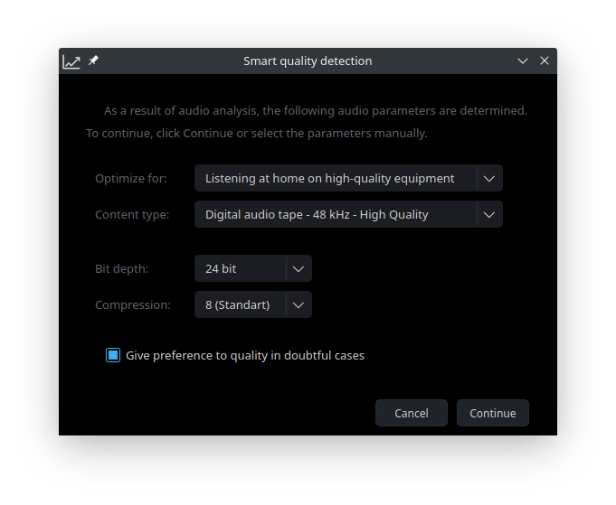

# Simplest Studio

Simplest Studio is an application that allows you optimize and convert audio files. The following encoding modes are implemented:

  - FLAC
  - WAV
  - DFF
  - MP3

### View


### Smart quality detection



### Installation

Supported operating system: Linux x86_64

##### - Arch Linux / Manjaro Linux:
  - install [AUR package](https://aur.archlinux.org/packages/simplest-studio/) or *.pkg.tar.xz file from release

##### - Other Linux:
  - install utility on your system:
    
    - ffmpeg
    - mediainfo

  - download and run file [simplest-studio-(ver)_other_linux_x86_64.run](https://github.com/SimplestStudio/simplest-studio/releases)

  
### Buid instructions

Install dependencies:

    - ffmpeg>=4.2
    - libmediainfo>=20.03
    - qt5-base>=5.14.2

Buld package:

```sh
cd ../app
make
```

### Licence

GNU GPL v.3
See [LICENSE.md](https://github.com/SimplestStudio/simplest-studio/blob/master/LICENSE)


### Donate

If you wish to support this project, you can make a donation for $0.5 or more via PayPal. Your contributions will help keep the project alive and support future development.

[](https://paypal.me/KozhukharenkoOleg?locale.x=ru_RU)

##### Bitcoin
You can send bitcoins at this address or by scanning the QR code below:


1PqFt976YQTJ9Js3xym5GjtPDfsjq98kN8
